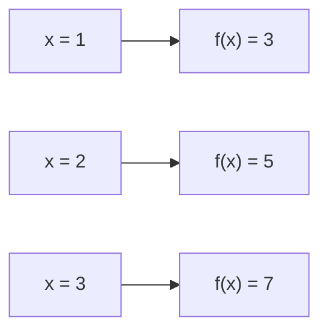
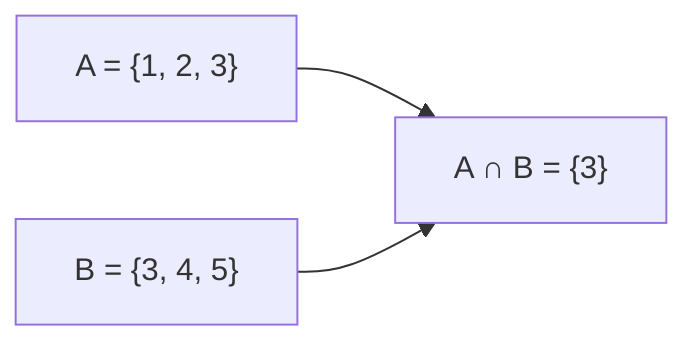
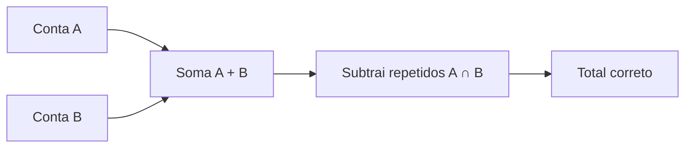

# Matemática Discreta Para OBI Em Python

Esta aula apresenta conceitos de matemática discreta pela visão matemática primeiro e, depois, mostra como aplicar cada ideia em Python.

## Tópicos

- Funções e relações
- Ordem lexicográfica
- Conjuntos
- Recursão
- Permutações e fatorial
- Progressão aritmética
- Princípio da casa dos pombos
- Princípio aditivo e multiplicativo
- Teoria dos jogos básica
- Progressão geométrica
- Combinações
- Triângulo de Pascal
- Inclusão-exclusão

---

# 1. Funções E Relações

## Visão Matemática

Uma **função** liga cada elemento de um conjunto de entrada a exatamente um elemento de saída.

Exemplo:

```text
f(x) = 2x + 1
```

Se `x = 3`:

```text
f(3) = 2 * 3 + 1
f(3) = 7
```

Uma **relação** liga elementos de dois conjuntos, mas não precisa obedecer à regra de "uma entrada, uma saída".

Exemplo de relação:

```text
a é divisor de b
```

O número `2` se relaciona com:

```text
4, 6, 8, 10, ...
```

## Figura



## Como Se Aplica Em Python

```python
def f(x):
    return 2 * x + 1

print(f(3))
```

## Explicação

A função matemática `f(x)` vira uma função Python com `def`.

O valor entra como parâmetro e o resultado sai com `return`.

---

# 2. Ordem Lexicográfica

## Visão Matemática

Ordem lexicográfica é a ordem de dicionário.

Compara primeiro o primeiro caractere.  
Se empatar, compara o segundo.  
Se empatar, compara o terceiro, e assim por diante.

Exemplo:

```text
ana < banana
ana < ano
casa > carro
```

Porque em `casa` e `carro`:

```text
c = c
a = a
s > r
```

## Figura

```text
carro
casa
 ^
 r < s
```

## Como Se Aplica Em Python

```python
palavras = ["banana", "ana", "casa", "carro"]
palavras.sort()

print(palavras)
```

Saída:

```text
['ana', 'banana', 'carro', 'casa']
```

## Explicação

Python já compara strings em ordem lexicográfica.

Por isso, `sort()` organiza palavras como em um dicionário.

---

# 3. Conjuntos

## Visão Matemática

Um conjunto é uma coleção de elementos sem repetição.

```text
A = {1, 2, 3}
B = {3, 4, 5}
```

União:

```text
A ∪ B = {1, 2, 3, 4, 5}
```

Interseção:

```text
A ∩ B = {3}
```

Diferença:

```text
A - B = {1, 2}
```

## Figura



## Como Se Aplica Em Python

```python
A = {1, 2, 3}
B = {3, 4, 5}

print(A | B)
print(A & B)
print(A - B)
```

## Explicação

Em Python:

- `|` representa união;
- `&` representa interseção;
- `-` representa diferença.

---

# 4. Recursão

## Visão Matemática

Recursão é definir algo usando ele mesmo em uma versão menor.

Exemplo:

```text
n! = n * (n - 1)!
```

Com caso base:

```text
0! = 1
```

Então:

```text
5! = 5 * 4!
4! = 4 * 3!
3! = 3 * 2!
2! = 2 * 1!
1! = 1 * 0!
0! = 1
```

## Figura

```text
5!
= 5 * 4!
= 5 * 4 * 3!
= 5 * 4 * 3 * 2!
= 5 * 4 * 3 * 2 * 1!
= 120
```

## Como Se Aplica Em Python

```python
def fatorial(n):
    if n == 0:
        return 1
    return n * fatorial(n - 1)

print(fatorial(5))
```

## Explicação

O caso base impede que a função chame a si mesma para sempre.

Sem caso base, a recursão não termina.

---

# 5. Permutações E Fatorial

## Visão Matemática

Permutação é uma forma de organizar elementos em ordem.

Se temos 3 pessoas:

```text
A, B, C
```

As organizações possíveis são:

```text
ABC
ACB
BAC
BCA
CAB
CBA
```

Total:

```text
3! = 3 * 2 * 1 = 6
```

Regra geral:

```text
n! = n * (n - 1) * ... * 2 * 1
```

## Figura

```text
3 opções para o 1º lugar
2 opções para o 2º lugar
1 opção para o 3º lugar

3 * 2 * 1 = 6
```

## Como Se Aplica Em Python

```python
import math

n = 3
print(math.factorial(n))
```

## Explicação

`math.factorial(n)` calcula `n!`.

Esse conceito aparece em problemas de contagem e organização de elementos.

---

# 6. Progressão Aritmética

## Visão Matemática

Progressão aritmética, ou PA, é uma sequência em que a diferença entre termos consecutivos é constante.

Exemplo:

```text
2, 5, 8, 11, 14
```

A razão é:

```text
r = 3
```

Fórmula do termo geral:

```text
a_n = a_1 + (n - 1) * r
```

Exemplo:

```text
a_1 = 2
r = 3
n = 5

a_5 = 2 + (5 - 1) * 3
a_5 = 14
```

## Figura

```text
2 --(+3)--> 5 --(+3)--> 8 --(+3)--> 11 --(+3)--> 14
```

## Como Se Aplica Em Python

```python
a1 = 2
r = 3
n = 5

an = a1 + (n - 1) * r
print(an)
```

## Explicação

A fórmula evita calcular termo por termo.

Isso é importante quando `n` é muito grande.

---

# 7. Princípio Da Casa Dos Pombos

## Visão Matemática

Se você tem mais objetos do que caixas, então alguma caixa terá mais de um objeto.

Exemplo:

```text
5 pombos
4 casas
```

Pelo menos uma casa terá 2 pombos.

## Exemplo OBI

Se existem 13 pessoas e apenas 12 meses, pelo menos duas pessoas nasceram no mesmo mês.

## Figura

```text
Pombos:  P P P P P
Casas:   [ ] [ ] [ ] [ ]

Distribuindo 5 em 4:
         [P] [P] [P] [P P]
```

## Como Se Aplica Em Python

```python
pombos = 5
casas = 4

if pombos > casas:
    print("Alguma casa tem mais de um pombo")
```

## Explicação

O código apenas verifica a condição principal:

```text
objetos > caixas
```

Quando isso acontece, há repetição obrigatória.

---

# 8. Princípio Aditivo E Multiplicativo

## Princípio Aditivo

Usado quando temos escolhas alternativas.

Exemplo:

```text
3 tipos de salgado
2 tipos de doce
```

Se vou escolher salgado **ou** doce:

```text
3 + 2 = 5 opções
```

## Princípio Multiplicativo

Usado quando temos escolhas em etapas.

Exemplo:

```text
3 camisetas
2 calças
```

Se vou escolher camiseta **e** calça:

```text
3 * 2 = 6 combinações
```

## Figura

```text
Aditivo:        salgado OU doce
                3 + 2 = 5

Multiplicativo: camiseta E calça
                3 * 2 = 6
```

## Como Se Aplica Em Python

```python
camisetas = 3
calcas = 2

print(camisetas * calcas)
```

## Explicação

Quando as escolhas acontecem em sequência, multiplicamos.

Quando as escolhas são alternativas, somamos.

---

# 9. Teoria Dos Jogos Básica

## Visão Matemática

Em jogos de dois jogadores, podemos classificar posições como:

```text
posição vencedora
posição perdedora
```

Uma posição é **vencedora** se existe pelo menos um movimento que leva o adversário a uma posição perdedora.

Uma posição é **perdedora** se todos os movimentos levam o adversário a posições vencedoras.

## Exemplo

Jogo: há `n` pedras. Em cada jogada, pode tirar 1 ou 2 pedras. Quem tira a última vence.

Análise:

```text
n = 0 -> perdedora
n = 1 -> vencedora
n = 2 -> vencedora
n = 3 -> perdedora
n = 4 -> vencedora
n = 5 -> vencedora
n = 6 -> perdedora
```

Padrão:

```text
múltiplos de 3 são posições perdedoras
```

## Figura

```text
0 P
1 V -> 0
2 V -> 0
3 P -> só vai para V
4 V -> 3
5 V -> 3
6 P
```

## Como Se Aplica Em Python

```python
n = int(input())

if n % 3 == 0:
    print("PERDEDORA")
else:
    print("VENCEDORA")
```

## Explicação

Se `n` é múltiplo de 3, qualquer jogada leva o adversário para uma posição vencedora.

Por isso, essa posição é perdedora.

---

# 10. Progressão Geométrica

## Visão Matemática

Progressão geométrica, ou PG, é uma sequência em que cada termo é multiplicado por uma razão constante.

Exemplo:

```text
2, 6, 18, 54
```

Razão:

```text
q = 3
```

Fórmula:

```text
a_n = a_1 * q^(n - 1)
```

Exemplo:

```text
a_1 = 2
q = 3
n = 4

a_4 = 2 * 3^3
a_4 = 54
```

## Figura

```text
2 --(*3)--> 6 --(*3)--> 18 --(*3)--> 54
```

## Como Se Aplica Em Python

```python
a1 = 2
q = 3
n = 4

an = a1 * (q ** (n - 1))
print(an)
```

## Explicação

O operador `**` faz exponenciação em Python.

---

# 11. Combinações

## Visão Matemática

Combinação é escolher elementos sem se importar com a ordem.

Exemplo:

Escolher 2 alunos entre 4:

```text
A, B, C, D
```

Combinações:

```text
AB, AC, AD, BC, BD, CD
```

Total:

```text
6
```

Fórmula:

```text
C(n, k) = n! / (k! * (n-k)!)
```

Exemplo:

```text
C(4, 2) = 4! / (2! * 2!)
C(4, 2) = 24 / 4
C(4, 2) = 6
```

## Figura

```text
Permutação considera AB e BA diferentes.
Combinação considera AB e BA a mesma escolha.
```

## Como Se Aplica Em Python

```python
import math

n = 4
k = 2

print(math.comb(n, k))
```

## Explicação

`math.comb(n, k)` calcula combinações.

Use combinação quando a ordem não importa.

---

# 12. Triângulo De Pascal

## Visão Matemática

O Triângulo de Pascal organiza coeficientes binomiais.

Cada número é a soma dos dois números acima dele.

```text
        1
      1   1
    1   2   1
  1   3   3   1
1   4   6   4   1
```

A linha `n` contém:

```text
C(n, 0), C(n, 1), C(n, 2), ..., C(n, n)
```

Exemplo linha 4:

```text
1 4 6 4 1
```

## Figura

```text
      1
    1 + 1
  1 + 2 + 1
1 + 3 + 3 + 1
```

## Como Se Aplica Em Python

```python
n = 5
pascal = []

for i in range(n):
    linha = [1] * (i + 1)

    for j in range(1, i):
        linha[j] = pascal[i - 1][j - 1] + pascal[i - 1][j]

    pascal.append(linha)

for linha in pascal:
    print(linha)
```

## Explicação

As bordas sempre são `1`.

Os valores internos são a soma dos dois valores acima.

---

# 13. Inclusão-Exclusão

## Visão Matemática

Usamos inclusão-exclusão para contar elementos em uniões sem contar repetidos duas vezes.

Para dois conjuntos:

```text
|A ∪ B| = |A| + |B| - |A ∩ B|
```

Exemplo:

```text
A = alunos que gostam de Python = 10
B = alunos que gostam de Java = 8
A ∩ B = gostam dos dois = 3
```

Então:

```text
A ∪ B = 10 + 8 - 3
A ∪ B = 15
```

## Por Que Subtrair?

Porque quem gosta dos dois foi contado duas vezes.

## Figura



## Como Se Aplica Em Python

```python
A = {"ana", "bia", "caio", "dan"}
B = {"caio", "dan", "edu"}

uniao = len(A) + len(B) - len(A & B)

print(uniao)
```

## Explicação

`A & B` encontra quem está nos dois conjuntos.

Subtraímos essa interseção para não contar repetido.

---

# Resumo Final

```text
Funções e relações        -> regras entre elementos
Ordem lexicográfica       -> ordem de dicionário
Conjuntos                 -> coleção sem repetição
Recursão                  -> definição usando caso menor
Permutações e fatorial    -> ordenar elementos
Progressão aritmética     -> soma constante
Casa dos pombos           -> mais objetos que caixas
Aditivo/multiplicativo    -> contar escolhas
Teoria dos jogos          -> posições vencedoras/perdedoras
Progressão geométrica     -> multiplicação constante
Combinações               -> escolher sem ordem
Triângulo de Pascal       -> combinações organizadas
Inclusão-exclusão         -> contar união sem duplicar
```

## Orientação Para A OBI

Na OBI, esses temas aparecem disfarçados em histórias.

O segredo é traduzir a história para:

- contagem;
- sequência;
- conjunto;
- função;
- relação;
- estado do jogo.

Depois dessa tradução, o código em Python fica muito mais simples.
